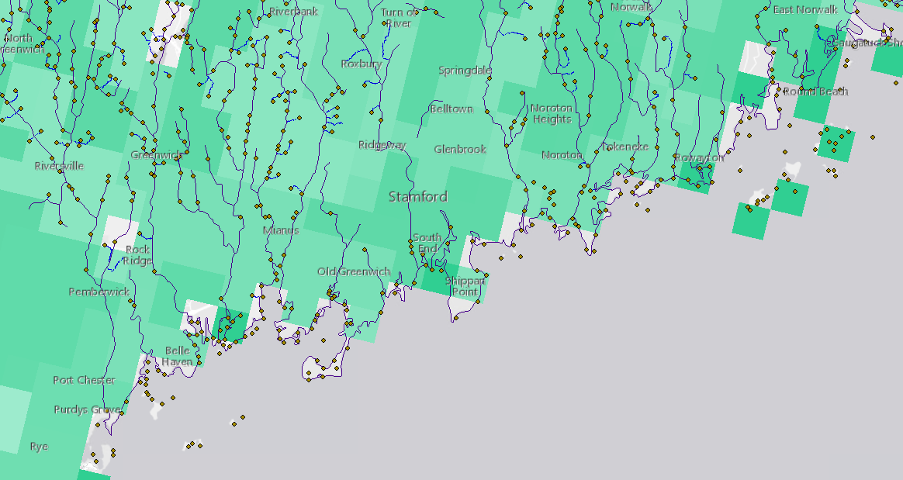
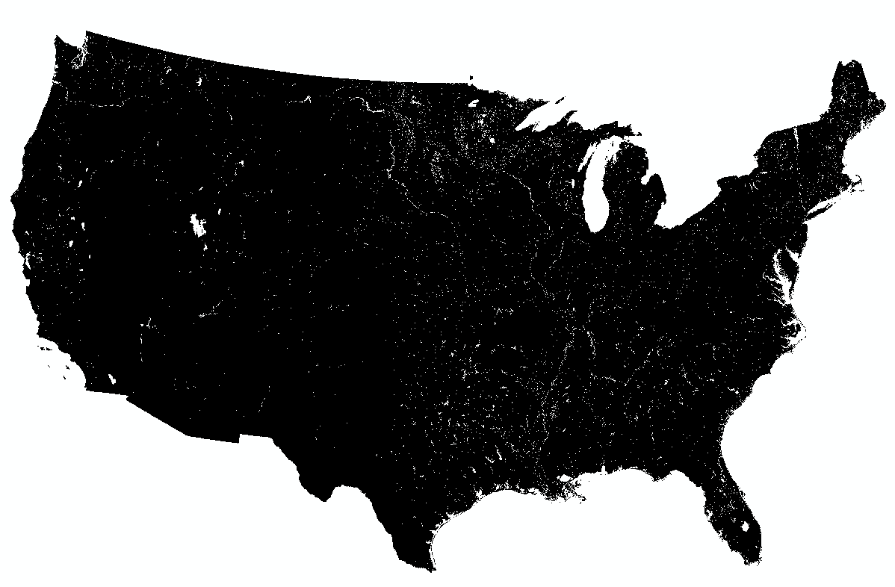
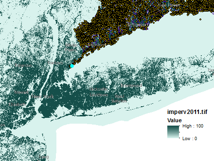
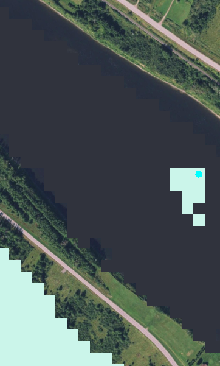

This file contains QA checks for the various tables in the FinalTables directory

Procedure:

1. Find reason for issue in region 01a
2. Fix and apply for all regions in MakeFinalTables.Rmd
3. Re-write RDS and check numbers again. If number of records still differ, move on to next region with problem.

Things we Know:

1. There can be differing number of NA records for each RPU for a given metric.  This is due to NA cells in that metric's raster.  NA's will often be along US borders, but for things like STATSGO you can have internal US NA areas that will show up in our result tables
2. Because of the way flow paths are created, there can be flow paths not directly associated with a wetland – think of them as ‘intermediate’ paths.  It’s not a problem – we connect everything via flow tables – just something to be aware of – so there can be more records in a region for flow path tables than there are wetlands.  However for final tables, we only keep records for each wetland, not each flow path.
3. For canal/ditch, we get higher numbers where a canal/ditch parallels the flow path, so take with a grain of salt - really best to treat as binary yes/no there is canal/ditch intersection that occurs.
4. The grid used to produce Runoff tables have missing values at the edges of the US and many NoData locations throughout the interior of the US (see images below). These NA values within and at edges of the US produce several thousand NA values within each region in the final Runoff tables.




5. We need to revisit Runoff tables because the revised grid sent by Jay Christensen seems like it has fewer ag drainage pixels in Florida than expected. We sent Jay a message to verify which layer we should be using.

6. Imperviousness raster uses zeros in many places where other rasters would have NA - I  believe this is fine, but just noting.



### Set up that was used for MakeFinalTables.Rmd
```{r, eval=F}
year = '2001'
final_path = paste0('L:/Priv/CORFiles/Geospatial_Library/Data/Project/WetlandConnectivity/SpatialDataInputs/Wetlands_NLCD',year,'/FinalTables/WetlandTables/')
# data_path = 'L:/Priv/CORFiles/Geospatial_Library/Data/Project/WetlandConnectivity/WetlandPath/Data'
# wetland_tables = 'L:/Priv/CORFiles/Geospatial_Library/Data/Project/WetlandConnectivity/FinalTables/WetlandTables/'
accum_path = paste0('L:/Priv/CORFiles/Geospatial_Library/Data/Project/WetlandConnectivity/SpatialDataInputs/Wetlands_NLCD',year,'/WetlandPath/Accumulation/')
accum_cat = paste0('L:/Priv/CORFiles/Geospatial_Library/Data/Project/WetlandConnectivity/SpatialDataInputs/Wetlands_NLCD',year,'/WetlandCat/Accumulation/')
# precip_path = 'L:/Priv/CORFiles/Geospatial_Library/Data/Project/WetlandConnectivity/WetlandCat/Accumulation/'
lookup_tables = paste0('L:/Priv/CORFiles/Geospatial_Library/Data/Project/WetlandConnectivity/SpatialDataInputs/Wetlands_NLCD',year,'/WetlandPath/LookupTables/')
cat_path = paste0('L:/Priv/CORFiles/Geospatial_Library/Data/Project/WetlandConnectivity/SpatialDataInputs/Wetlands_NLCD',year,'/WetlandCat/WetCats/')
wet_path = paste0('L:/Priv/CORFiles/Geospatial_Library/Data/Project/WetlandConnectivity/SpatialDataInputs/Wetlands_NLCD',year,'/AllWetlands_rpu/')
cost_path = paste0('L:/Priv/CORFiles/Geospatial_Library/Data/Project/WetlandConnectivity/SpatialDataInputs/Wetlands_NLCD',year,'/WetlandPath/CostPaths/')
#table_combo = 'L:/Priv/CORFiles/Geospatial_Library/Data/Project/WetlandConnectivity/CombiningTables/'

files = list.files(accum_path, pattern = 'NLCD'); rpus = c()
for(i in 1:length(files)){
  #print(files[i])
  rpus[i] = substr(files[i], 18, 20)
}
```

### Code to examine RDS and CSV files

#### Examine the number of records from each RDS
We're see differences in results, we'll need to drill down to the .csv files by rpu
```{r, eval=F}

wd = paste0('L:/Priv/CORFiles/Geospatial_Library/Data/Project/WetlandConnectivity/SpatialDataInputs/Wetlands_NLCD', year, '/FinalTables/')

#Get list of RDS files
files = list.files(wd, pattern='.rds')

#Loop through RDS files and open them
for(i in 1:length(files)){
  print(files[i])
  tmp = readRDS(paste0(wd, files[i]))
  print(nrow(tmp))
  #print(summary(tmp))
}
```

#### Find NAs and examine in ArcMap.


```{r, eval=F}
library(foreign)
#Change year to access files from 2001 or 2011
year = 2001
pattern = '10g'

wd = paste0('L:/Priv/CORFiles/Geospatial_Library/Data/Project/WetlandConnectivity/SpatialDataInputs/Wetlands_NLCD', year, '/FinalTables/WetlandTables/')

#Get list of CSV files
files = list.files(wd, pattern=pattern)
#Loop through CSV files and open them
for(i in 1:length(files)){
  print(files[i])
  tmp = read.csv(paste0(wd, files[i]))
  print(nrow(tmp))
  print(summary(tmp))
}

var = 'AgDrainage_Basin_'
tmp = read.csv(paste0(wd, var, pattern, '.csv'))
print(summary(tmp))
print(head(tmp[is.na(tmp$PctAgDrainBasin),], n=50))
print(tail(tmp[is.na(tmp$PctAgDrainBasin),], n=50))

var = 'RunoffFreq_'
tmp = read.csv(paste0(wd, var, pattern, '.csv'))
print(summary(tmp))
print(head(tmp[is.na(tmp$DomFldFreqCls),], n=50))
print(tail(tmp[is.na(tmp$DomFldFreqCls),], n=50))

tmp[tmp$WET_ID == 417866,]

```


#### Examine the number of records from each CSV and compare to wetland catchments and all-wetlands
What we see is that number of records always match between wetlands for a given rpu and number of records in final table, but that we have fewer records in the .dbf of our catchments.  The records missing for wetland catchments are for wetlands that are 100% riparian and didn't get wetland 'watershed' built because wetland point occured where the flow direction raster was null.

A good example of where a wetland catchment is never built is something like this wetland on an island in a stream - this is within area of what we define as 'FDR Null' and can't build a watershed for this



```{r, eval=F}
library(foreign)
#Change year to access files from 2001 or 2011
year = 2001
pattern = '01a'

wd = paste0('L:/Priv/CORFiles/Geospatial_Library/Data/Project/WetlandConnectivity/SpatialDataInputs/Wetlands_NLCD', year, '/FinalTables/WetlandTables/')

#Get list of CSV files
files = list.files(wd, pattern=pattern)
#Loop through CSV files and open them
for(i in 1:length(files)){
  print(files[i])
  cats = read.dbf(paste0(cat_path, 'WetlandCat_', pattern, '.tif.vat.dbf'))
  print(paste0('Cats = ', nrow(cats)))
  wetlands = read.dbf(paste0(wet_path, 'Wetlands_', pattern, '.tif.vat.dbf'))
  print(paste0('wetlands = ', nrow(wetlands)))
  tmp = read.csv(paste0(wd, files[i]))
  print(nrow(tmp))
  #print(summary(tmp))
}
```

### BasinAreaSqKm files. 
These tables reflect the difference noted in chunk above - we did not create wetland basins for wetlands where the wetland pour point was within the stream FDRNull cells (wetland considered essentially 'inside' of stream so couldn't produce wetland basin).

The question is, does it make sense to have the BasinAreaSqKm files only reflect wetlands that do have basins, or should these tables have the same number of records as all the other tables?

```{r, eval=F}
#Change year to access files from 2001 or 2011
year = 2001
i=1

wd = paste0('L:/Priv/CORFiles/Geospatial_Library/Data/Project/WetlandConnectivity/SpatialDataInputs/Wetlands_NLCD', year, '/FinalTables/WetlandTables/')

t1 = read.csv(paste0(wd, 'AgDrainage_Basin_', rpus[i], '.csv'))
print(nrow(t1))
t2 = read.csv(paste0(wd, 'BasinAreaSqKm_', rpus[i], '.csv'))
print(nrow(t2))

#Difference
print(nrow(t1) - nrow(t2))

setdiff(t1$WET_ID, t2$WET_ID)
```

#### Original code to make BasinAreaSqKm from MakeFinalTables.Rmd
This shows that we use catchment accumulation files to produce wetland basin areas - and as noted above, we don't produce wetland basins for wetlands where the wetland pour point is within stream FDR Null cells.

```{r, eval=F}
# cat_dir = accum_cat
# 
# i = 1
# #for(i in 1:length(rpus)){
#   print(rpus[i])
#   precip = read.csv(paste0(cat_dir, 'US2yr24ha_mm_10x_MEAN_', rpus[i], '.csv'))
#   #---------------------------------------
#     #Add check of nrow
#   nrow(precip)
#   nrow(t2) #Matches nrow in final table. The precip table has fewer records than it should
#   #---------------------------------------
#   precip$AreaSqKm = (precip$COUNT * 900) / 1e6
#   precip = precip[, c('BasinID','AreaSqKm')]
#   names(precip)[1] = 'BASINID'
#   write.csv(precip, paste0(final_path, 'BasinAreaSqKm_', rpus[i], '.csv'), row.names=F)
#}
```

### Why more records in Levee Influence tables?
```{r, eval=F}
library(foreign)
#Change year to access files from 2001 or 2011
year = 2001
pattern = '01a'

wd = paste0('L:/Priv/CORFiles/Geospatial_Library/Data/Project/WetlandConnectivity/SpatialDataInputs/Wetlands_NLCD', year, '/FinalTables/WetlandTables/')

#Get list of CSV files
files = list.files(wd, pattern=pattern)
#Loop through CSV files and open them
for(i in 1:length(files)){
  print(files[i])
  cats = read.dbf(paste0(cat_path, 'WetlandCat_', pattern, '.tif.vat.dbf'))
  print(paste0('Cats = ', nrow(cats)))
  wetlands = read.dbf(paste0(wet_path, 'Wetlands_', pattern, '.tif.vat.dbf'))
  print(paste0('wetlands = ', nrow(wetlands)))
  wetland_paths = read.dbf(paste0(cost_path, 'StreamLink', pattern, '.tif.vat.dbf'))
  print(paste0('Wetland paths = ', nrow(wetland_paths)))
  tmp = read.csv(paste0(wd, files[i]))
  print(paste0('Final table = ', nrow(tmp)))
  print('---------------------------------------------')
  #print(summary(tmp))
}
```